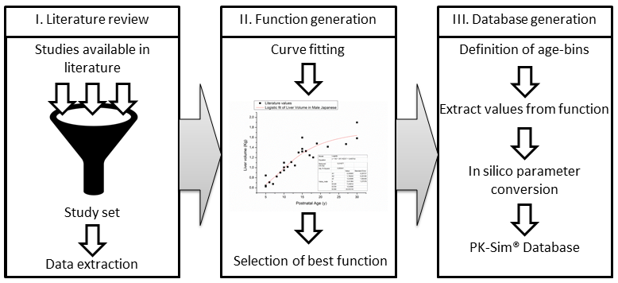
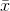
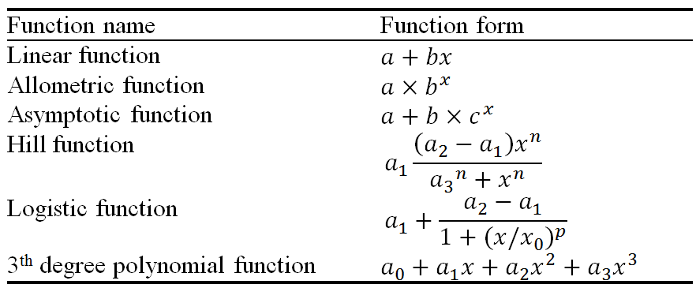
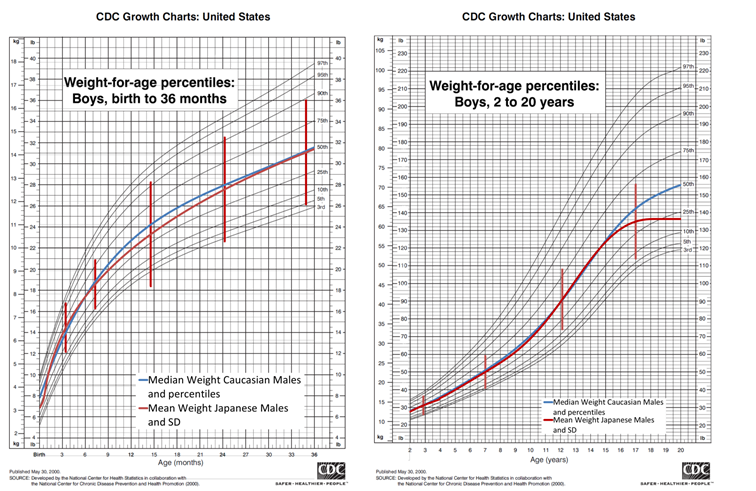
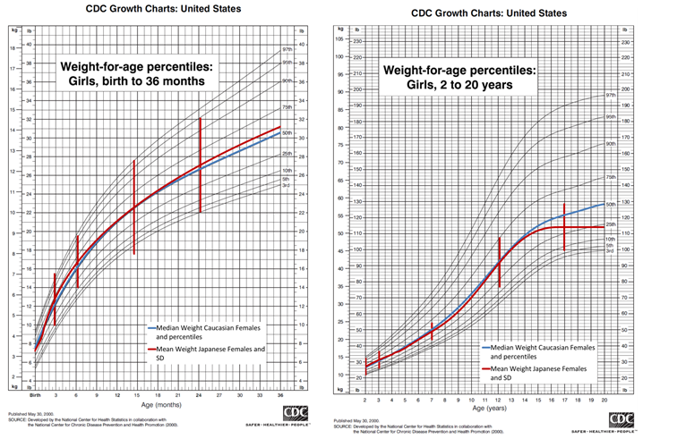
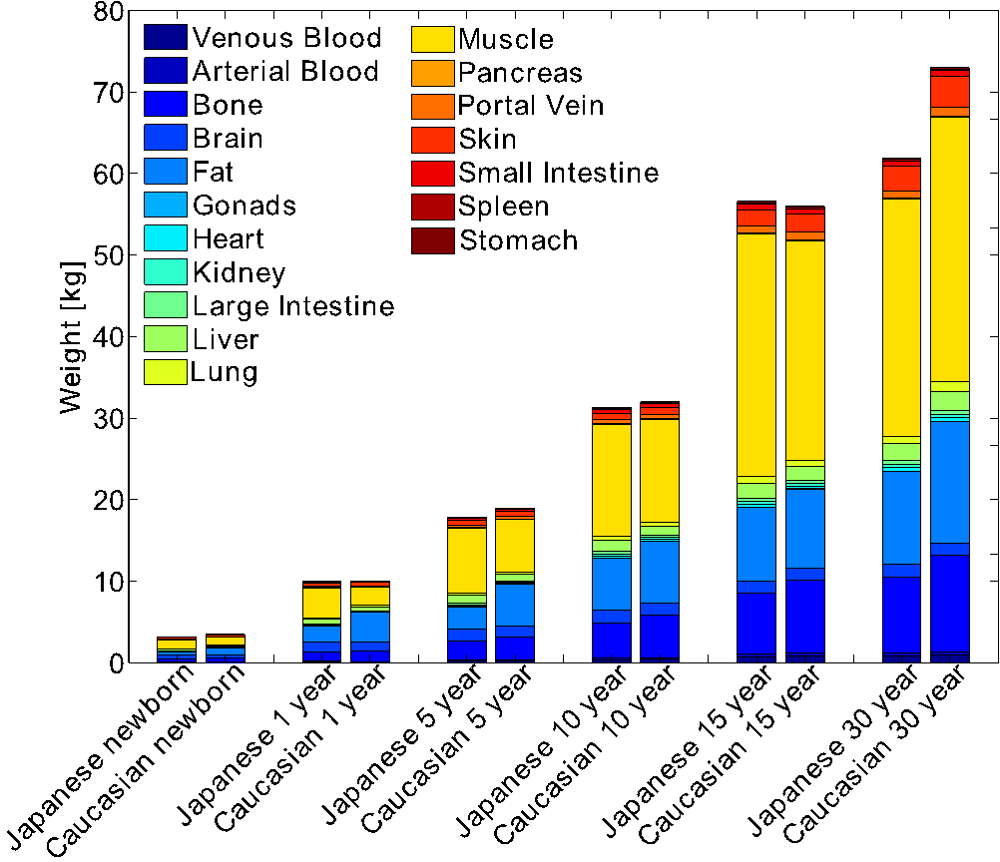
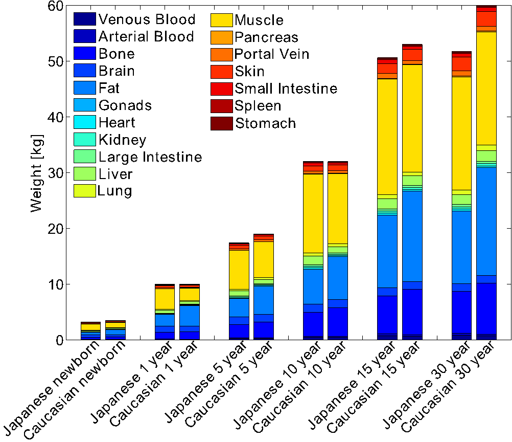
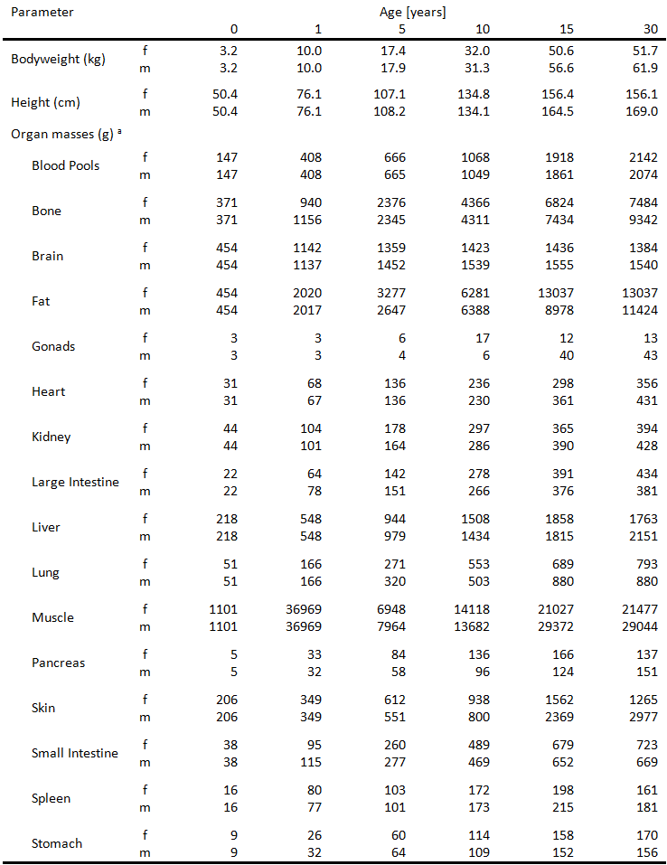
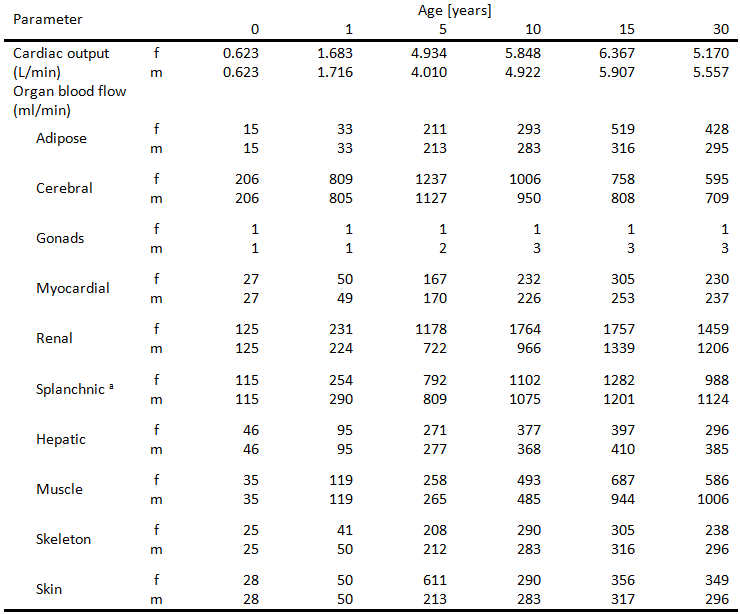

# 1. Executive Summary

Anatomical and physiological maturation from birth to 30 years of life were informed based on literature information and subsequently integrated into a whole-body PBPK approach. Thereby, a knowledge-driven PBPK population database for Japanese was successfully developed. This methodology enables an age-dependent description of concentration-time profiles from birth to 30 years of age.

Comprehensive data was retrieved for most model parameters which allowed to inform the physiological and anatomical maturation from birth to early adulthood. No studies matching the inclusion criteria were retrieved for muscle, skin and the gastrointestinal organs. In contrast to studies on change in organ volume during the aging process, studies on blood-flow rates and cardiac output distribution were sparse or used questionable analytical methods. Here, knowledge from Europeans was derived to inform the PBPK population database. In addition, model-specific parameters such as vascular, interstitial or cellular organ fractions were assumed to be equal between Europeans and Japanese. 

# 2. Introduction

Ethnic-related physiological differences are known and many of them can significantly affect drug pharmacokinetics (PK). Consequently, dose adjustments can be indicated for certain populations for a variety of drugs. 

One approach that may contribute to close this knowledge gap is physiologically-based pharmacokinetic (PBPK) modeling. PBPK models rely on *a priori* knowledge on physiological processes and integrate them within a mechanistic framework, which allows the prediction of absorption, distribution, metabolism, and excretion (ADME) properties of a drug ([Kuepfer et al., 2016](#6-references)). Such models have proven to be a useful tool for predicting drug PK in various special populations, in particular preterm neonates ([Claassen et al., 2015](#6-references)), children ([Maharaj et al., 2013](#6-references)), elderly ([Schlender et al., 2016](#6-references)), renally or hepatically impaired patients ([Edginton and Willmann, 2008](#6-references)). Integral to these models is the vast amount of anatomical and physiological data underlying the model structure. 

This analysis provides a Japanese PBPK population database based on literature information that accounts for changes in anatomical and physiological parameters from newborn children to adults. Therefore, the literature was reviewed with a focus on physiological characteristics in Japanese subjects from birth to adulthood. The goal of this part was to bridge an existing PBPK approach for Europeans based on the International Commission on Radiological Protection (ICRP) report ([Valentin, 2002](#6-references)) to the Japanese population to encompass the full course of healthy maturation in this population.

# 3. Modeling strategy and workflow

## 3.1  Japanese PBPK population database development 

First, a systemic literature search was carried out to collect relevant anatomical and physiological study data required for developing of a Japanese PBPK population database. Literature data were analyzed if they met specific inclusion criteria. For each parameter, a batch of mathematical functions was subsequently fitted to the data. In a final step, the best performing functions were selected and implemented in a PBPK poplation database for Japanese. **Figure 3‑1** schematically illustrates this workflow.

**Figure 3‑1** Workflow of this study. 

## 3.2 Data used

### 3.2.1 Literature search

The literature was searched for each parameter with various key words using PubMed (http://www.ncbi.nlm.nih.gov/pubmed/), J-STAGE (https://www.jstage.jst.go.jp/browse) and Google Scholar (https://scholar.google.de/). Body weight and height or body mass index (anthropometric measures), as well as anatomical and (patho)physiological parameters, were searched using additional terms such as ‘Japanese’. Publications in Japanese language were not considered. Collected studies were scrutinized for possible additional references that were not covered by the literature search. 

Studies identified in the literature search were included in a preliminary study set if they met the following inclusion criteria: (a) clear assignment of sex, (b) clear assignment of race, (c) a comprehensible statement regarding the method of analysis, and (d) ruling out of effects of medication or disease on subjects’ physiology. Studies that included longitudinal surveillance were preferred. Since *in vivo* measurements of organ size are not directly comparable to measurements obtained from autopsy reports, the former were taken into consideration only for the evaluation of muscle, fat, and blood flow ([Saisho et al., 2007](#6-references)). Furthermore, for each study cohort the available details about body composition, for example fat mass, fat-free mass and lean-body mass, as well as total body water were extracted and used as covariates.

### 3.2.2 Data extraction

Data extracted from the included study set were compiled in a Microsoft Excel 2010® spreadsheet and prepared for further analyses. An in-house developed tool of Bayer AG was used to extract data from plots and convert these into numerical values. For the sake of simplicity, the density of all organs was assumed to be 1 kg/dm³, unless weight and volume deviated from each other by more than 5%. In case the exact number of studied individuals was not reported it was arbitrarily set to one. 

In most cases values were reported as a geometric mean () and geometric standard deviation (*SD*). In cases where the *µ* and *σ* define a lognormal distribution, the associated geometric mean value () and geometric standard deviation () of the lognormal distribution were used as comparable parameters.

### 3.2.3 Included data

All studies considered for the Japanese PBPK population model used to inform the changes in the respective organ are listed in **Table 1**. The general lack of perfusion data impeded the computation of a robust variability for each blood flow rate, so that a 5 % coefficient of variation was assumed as accepted for other approaches ([McNally et al., 2014](#6-references)). In total, 15 studies were included to build the Japanese PBPK population database. 

**Table** **1** Studies utilized for model building to determine changes in organ volume and specific organ blood flow development over the course of maturation in healthy Japanese

| **Physiological measure** | **Reference**                                                |
| ------------------------- | ------------------------------------------------------------ |
| Antropometry              | ([Agency IAE 1998](#6-references); [Eveleth et al., 1990](#6-references); [Fujii et al., 2011](#6-references); [Katoda, 1991](#6-references); [Ogiu et al., 1997](#6-references); [Sumiya et al., 2001](#6-references); [Takaishi and KATO, 1999](#6-references);   [Tanaka et al., 2004](#6-references); [Tanner et al., 1982](#6-references)) |
| Organ volumes             |                                                              |
| Bone                      | ([Sakai et al., 2011](#6-references); [Tanaka et al., 1998](#6-references)) |
| Brain                     | ([Agency IAE 1998](#6-references); [Ogiu et al., 1997](#6-references)) |
| Fat                       | ([Fujii et al., 2011](#6-references); [Komiya et al., 2004](#6-references); [Nakao and Komiya, 2003](#6-references); [Otoki et al., 1999](#6-references); [Sakai et al., 2011](#6-references); [Teramoto et al., 1999](#6-references)) |
| Gonads                    | ([Agency IAE 1998](#6-references); [Tanaka et al., 1998](#6-references)) |
| Heart                     | ([Agency IAE 1998](#6-references); [Ogiu et al., 1997](#6-references)) |
| Kidney                    | ([Agency IAE 1998](#6-references); [Ogiu et al., 1997](#6-references)) |
| Liver                     | ([Agency IAE 1998](#6-references); [Ogiu et al., 1997](#6-references)) |
| Lung                      | ([Agency IAE 1998](#6-references); [Ogiu et al., 1997](#6-references)) |
| Muscle                    | -                                                            |
| Pancreas                  | ([Agency IAE 1998](#6-references); [Ogiu et al., 1997](#6-references)) |
| Skin                      | -                                                            |
| Spleen                    | ([Agency IAE 1998](#6-references); [Ogiu et al., 1997](#6-references)) |
| Cardiac output            | ([Katori, 1979](#6-references))                                  |

For those organs for which no literature data was obtained, information was derived from other sources. 

- Maturation of the blood pools, arterial and venous blood as well as portal vein, were informed by considering the ratio of each pool to the total blood volume indicated in the ICRP report ([Valentin, 2002](#6-references)) and by a subsequent application of this ratio to the reported blood volume for Japanese in the country report Japanese in the Reference Asian Man ([Tanaka et al., 1998](#6-references))

- For the skin volume age-related changes of the body surface area (BSA) were calculated based on Mosteller ([Mosteller, 1987](#6-references)) for a given body height and weight for each age. Then, again, the ratio of skin weight to BSA indicated in the ICRP report was multiplied to the computed BSA of Japanese.

- Muscle mass in Japanese was informed by considering the ratio of lean body mass to muscle mass indicated in the ICRP report ([Valentin, 2002](#6-references)) and multiplying this with the reported lean body mass of Japanese.

- No additional information was obtained for the gastrointestinal tract. Parametrization was taken from the European population ([Edginton et al., 2006](#6-references)).

- No perfusion data was retrieved from the literature. Therefore, the ratio between organ blood flow rate and cardiac output for a certain age was taken from the ICRP report ([Valentin, 2002](#6-references)) and applied to the cardiac output information obtained from the literature for the Japanese population. 

## 3.3 Modeling parameters

### 3.3.1 Regression analysis and diagnostics

Using the software Origin® (version X, OriginLab Corporation, Northamption, USA, [www.originLab.com](http://www.originLab.com)), a set of one-dimensional mathematical functions which are built-in in Origin® was fitted to the data using postnatal age (PNA) as regressor. The fitting procedure can be found in the Origin® user guide. 

**Table** **2** Functions fitted to the data collected from the literature

**Table 2** shows the variety of functions that were considered to account for the different trends observed among the data. Of note, for most organs, age-grouping was applied to better describe the data and being able to apply different functions. The cut-offs were selected after visual inspection. From these derived functions only part of the age-span where the function was applied was used, and purely served for data description, not for prediction.

A separate fit was made for males and females. For each curve fit, a summary of parameters, statistics (reduced chi-square, residual sum of squares and Adj. R-Square) were created. 

### 3.3.2 Generation of the whole-body PBPK population database for Japanese

Maturation changes of physiological parameters were evaluated for each year of life from birth to 30 years of age. Data was obtained and handled as described in 3.2.3. Since literature data do not consider vascular and parts of the interstitial spaces for each organ and tissue, respective fractions were added. These fractions summarize the difference between an ICRP-reported organ volume without blood and an *in silico* organ volume in PK-Sim ([Edginton et al., 2006](#6-references)). 

The processed organ masses were summed up and found to reach 91-95 % of the body weight; the gap accounts for smaller organs not captured in this model, for example the adrenal glands, thyroid, tongue and prostate. In order to reach the final body weights, muscle and fat mass was increased in proportion to this gap.

Age-related changes in organ blood flow rates were accounted for as changes in cardiac output. Blood flow rates and cardiac output values were taken from the literature. The sum of all organ blood flows should be equal to the cardiac output. Thus, the unknown age-dependent organ blood flows were scaled with regard to their relative cardiac output contributions in adults as postulated by the ICRP report ([Valentin, 2002](#6-references)) to match the age-related changes in cardiac output. In these cases, the ratio between organ blood flow rate and cardiac output remained the same over the age span. 

# 4. Results

## 4.1 Whole-body PBPK population database for Japanese

### 4.1.1 Demographics

Japanese adult individuals are on average slightly smaller and have approximately 15% to 20% smaller body weight than adult Europeans. A comparison of growth charts for Caucasian children based on the CDC database ([Kuczmarski, 2000](#6-references)) with data for Japanese children ([Ogiu et al., 1997](#6-references)) revealed that the difference in body weight starts above an age of 14 to 15 years. Below this age, the differences in anthropometry between Europeans and Japanese children are marginal. This is visualized in **Figure 5‑1**.

**Figure** **5‑1** Comparison of growth charts between Caucasian and Japanese children. Boys are visualized in the upper panel, while girls are shown in the lower panel. The figures on the left side range from birth to the age of 3 years, while the right side shows the maturation from 2 to 20 years

In Japanese males, accelerated growth of organs during the puberty was observed and nearly no fat mass gain during that time. In females, the percentage of mass decreases over 16 years, while it increases in Europeans. The total body fat mass in females showed to be higher than in males in both populations. 

The anatomical and physiological characteristics are opposed to mean European individuals of the same age in a graphical visualization in **Figure 5‑2**.

**Figure** **5‑2** Comparison of body composition between European and Japanese subjects between birth and adulthood in males (upper panel) and females (lower panel)

The overall body composition over the course of maturation for as implemented in the PBPK population model for Japanese is listed in **Table 3**. 

**Table** **3** Anthropometric measures, organ and tissue weights including blood content as used in the Japanese PBPK model

​		f:female, m:male

​		a Blood pools represent arterial and venous blood as well as blood in the portal vein

 

**Table** **4** Cardiac index and organ blood flow rates used in the Japanese PBPK model

​		f:female, m:male

​		a Splanchnic blood flow rate combines gastro-intestinal, pancreatic and splenic blood flow and describes the portal blood flow

# 5. Discussion

A knowledge-driven PBPK population for Japanese was successfully developed. Anatomical and physiological maturation from birth to 30 years of life were informed based on literature information and subsequently integrated into a whole-body PBPK approach. 

Besides comprehensive information on most parameters, no studies matching the inclusion criteria were retrieved for muscle, skin and the gastrointestinal organs. In contrast to studies on change in organ volume during the aging process, studies on blood-flow rates and cardiac output distribution were sparse or used questionable analytical methods. Here, knowledge from Europeans was derived to inform the PBPK population database. In addition, model-specific parameters such as vascular, interstitial or cellular organ fractions were assumed to be equal between Europeans and Japanese. 

In this study, parameters relevant to a PBPK approach were gathered by a comprehensive review of the literature, and they were integrated into a knowledge-driven PBPK approach for Japanese that captures whole-body physiology. This methodology enables an age-dependent description of concentration-time profiles from birth to 30 years of age. 

# 6. References

Agency IAE 1998. Compilation of Anatomical, Physiological and Metabolic Characteristics for a Reference Asian Man Volume 2: Country Reports.

Claassen, K., Thelen, K., Coboeken, K., Gaub, T., Lippert, J., Allegaert, K., Willmann, S., 2015. Development of a physiologically-based pharmacokinetic model for preterm neonates: evaluation with in vivo data. Current Pharmaceutical Design 21, 5688-5698.

Edginton, A.N., Schmitt, W., Willmann, S., 2006. Development and evaluation of a generic physiologically based pharmacokinetic model for children. Clinical pharmacokinetics 45, 1013-1034.

Edginton, A.N., Willmann, S., 2008. Physiology-based simulations of a pathological condition. Clinical pharmacokinetics 47, 743-752.

Eveleth, P.B., Tanner, J.M., Tanner, J.M., 1990. Worldwide Variation in Human Growth. Cambridge University Press.

Fujii, K., Mishima, T., Watanabe, E., Seki, K., 2011. Change with age in regression construction of fat percentage for BMI in school-age children. Journal of physiological anthropology 30, 69-76.

Katoda, H., 1991. Height and weight of Tokyo schoolchildren with and without intellectual handicaps. Annals of human biology 18, 327-339.

Katori, R., 1979. Normal cardiac output in relation to age and body size. The Tohoku journal of experimental medicine 128, 377-387.

Komiya, S., Masuda, T., Nakao, T., Teramoto, K., 2004. The relationships between stature, fat-free mass index, and fat mass index at before and after BMI-rebound in children. Journal of Health Science 26, 31-39.

Kuczmarski, R.J., 2000. CDC growth charts; United States.

Kuepfer, L., Niederalt, C., Wendl, T., Schlender, J.F., Willmann, S., Lippert, J., Block, M., Eissing, T., Teutonico, D., 2016. Applied Concepts in PBPK Modeling: How to Build a PBPK/PD Model. CPT: pharmacometrics & systems pharmacology 5, 516-531.

Maharaj, A., Barrett, J., Edginton, A., 2013. A workflow example of PBPK modeling to support pediatric research and development: case study with lorazepam. The AAPS Journal 15, 455-464.

McNally, K., Cotton, R., Hogg, A., Loizou, G., 2014. PopGen: A virtual human population generator. Toxicology 315, 70-85.

Mosteller, R., 1987. Simplified calculation of body surface area. N Engl J Med 317, 1098.

Nakao, T., Komiya, S., 2003. Reference norms for a fat-free mass index and fat mass index in the Japanese child population. Journal of physiological anthropology and applied human science 22, 293-298.

Ogiu, N., Nakamura, Y., Ijiri, I., Hiraiwa, K., Ogiu, T., 1997. A statistical analysis of the internal organ weights of normal Japanese people. Health physics 72, 368-383.

Otoki, K., Komiya, S., Teramoto, K., Masuda, T., Ube, M., 1999. Gender differences in body fat distribution of 3-to 6-year-old Japanese children. Japanese Journal of Physical Fitness and Sports Medicine 48, 641-649.

Saisho, Y., Butler, A.E., Meier, J.J., Monchamp, T., Allen-Auerbach, M., Rizza, R.A., Butler, P.C., 2007. Pancreas volumes in humans from birth to age one hundred taking into account sex, obesity, and presence of type-2 diabetes. Clin Anat 20, 933-942.

Sakai, T., Demura, S., Fujii, K., 2011. Age-related changes of body composition structure based on differences in morphological qualities of Japanese preschool children. Journal of physiological anthropology 30, 213-221.

Schlender, J.-F., Meyer, M., Thelen, K., Krauss, M., Willmann, S., Eissing, T., Jaehde, U., 2016. Development of a Whole-Body Physiologically Based Pharmacokinetic Approach to Assess the Pharmacokinetics of Drugs in Elderly Individuals. Clinical pharmacokinetics, 1-17.

Sumiya, T., Tashima, T., Nakahara, H., Shohoji, T., 2001. Relationships between biological parameters of Japanese growth of height. Environmetrics: The official journal of the International Environmetrics Society 12, 367-382.

Takaishi, M., KATO, N., 1999. A longitudinal study of the physical growth of Japanese infants. Annals of human biology 26, 353-363.

Tanaka, C., Murata, M., Homma, M., Kawahara, T., 2004. Reference charts of body proportion for Japanese girls and boys. Annals of human biology 31, 681-689.

Tanaka, G., Kawamura, H., Griffith, R., Cristy, M., Eckerman, K., 1998. Reference man models for males and females of six age groups of Asian populations. Radiation protection dosimetry 79, 383-386.

Tanner, J.M., Hayashi, T., Preece, M., Cameron, N., 1982. Increase in length of leg relative to trunk in Japanese children and adults from 1957 to 1977: comparison with British and with Japanese Americans. Annals of human biology 9, 411-423.

Teramoto, K., Otoki, K., Komiya, S., 1999. Age-related changes in body composition of 3-to 6-year-old Japanese children. Applied Human Science 18, 153-160.

Valentin, J., 2002. Basic anatomical and physiological data for use in radiological protection: reference values: ICRP Publication 89. Annals of the ICRP 32, 1-277.
